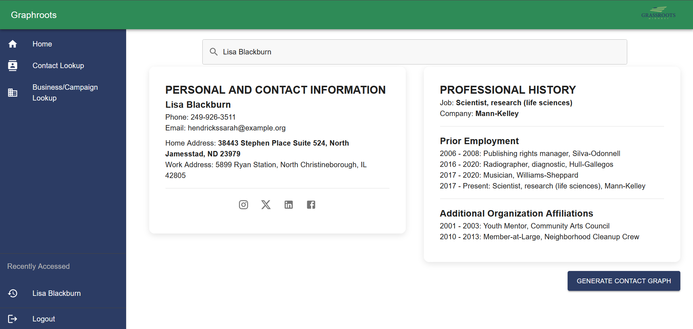
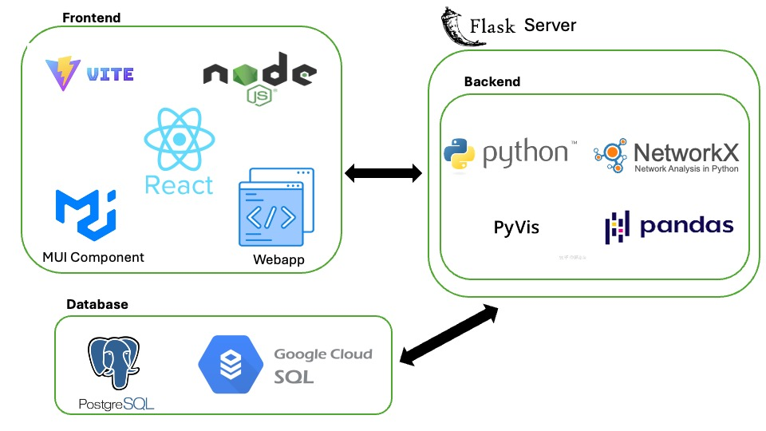

# GraphRoots — Relationship Graph Explorer

   

GraphRoots is a data viewer that lets a political-consulting firm search people and companies in its contact database and generate an **interactive relationship graph** of how they are connected (shared employers, affiliations, projects). Built as the Michigan State University **CMSE 495 Data Science Capstone** with community partner [Grassroots Midwest](https://www.grassrootsmidwest.com/), working from a de-identified clone of the partner's database.



## Highlights

- Python graph engine (NetworkX + PyVis) that builds person-centric and company-centric relationship networks from employment and affiliation histories.
- Flask REST API (`flask_api.py`) serving search results and generated graph HTML to the frontend.
- React + Vite single-page app with Contact Lookup and Business Lookup pages and a recent-searches context.
- SQLAlchemy/PostgreSQL loader (`db_loader.py`) with demo Excel files so the app runs without partner data.
- Team project (5 students); demo video: https://www.youtube.com/watch?v=RwhB-6ntZxg

## Architecture



- `graph_generator.py` / `business_graph_generator.py` — build individual and company graphs
- `find_person.py` — search and contact-detail lookup
- `flask_api.py` — API consumed by the frontend
- `graphroots/` — React (Vite) frontend
- `notebooks/` — early exploratory graph prototypes (outputs cleared to avoid partner data)

## Running Locally

See [INSTALL.md](INSTALL.md) for full setup. In short:

```bash
pip install -r requirements.txt
python flask_api.py            # starts the API
cd graphroots && npm install && npm run dev   # starts the UI
```

The `Demo_Files/` folder contains synthetic Excel inputs so the app can be run without access to the partner database.

## Repository Structure

```text
graphroots/
├── Demo_Files/
│   ├── CompanyPrimaryContactDemo.xlsx
│   ├── IndividualAffiliationHistoryDemo.xlsx
│   ├── IndividualEmploymentHistoryDemo.xlsx
│   └── IndividualPrimaryContactDemo.xlsx
├── graphroots/
│   ├── public/
│   │   └── vite.svg
│   ├── src/
│   │   ├── assets/
│   │   │   ├── Grassrootshome.png
│   │   │   └── react.svg
│   │   ├── components/
│   │   │   └── AppBar.jsx
│   │   ├── context/
│   │   │   └── RecentSearchesContext.jsx
│   │   ├── pages/
│   │   │   ├── BusinessLookup.jsx
│   │   │   ├── ContactLookup.jsx
│   │   │   └── Home.jsx
│   │   ├── App.css
│   │   ├── App.jsx
│   │   ├── index.css
│   │   └── main.jsx
│   ├── eslint.config.js
│   ├── index.html
│   ├── package-lock.json
│   ├── package.json
│   ├── README.md
│   └── vite.config.js
├── Images/
│   ├── Business_Graph.png
│   ├── Business_Search.png
│   ├── Business_Search_Bar.png
│   ├── Individual_Graph.png
│   ├── Individual_Search.png
│   ├── Individual_Search_Bar.png
│   └── Software_Architechture.jpeg
├── notebooks/
│   ├── graph_prototype.ipynb
│   └── grassroots_exploration.ipynb
├── business_graph_generator.py
├── db_loader.py
├── environment.yml
├── Figure_Reproducibility_Instructions.ipynb
├── find_person.py
├── flask_api.py
├── graph_generator.py
├── INSTALL.md
├── LICENSE
├── README.md
└── requirements.txt
```

## Tech Stack

Python, Flask, NetworkX, PyVis, pandas, SQLAlchemy, PostgreSQL, React, Vite, JavaScript

## Getting Started

See **Running Locally** above.

## Author

Built by MSU Data Science majors **Pranta Nir Barua, Suzy Kriser, Siddak Marwaha, Isabella Tang, and Annie Wozniak**, in collaboration with Claire Benson at Grassroots Midwest, under the CMSE 495 capstone taught by Dr. Dirk Colbry. This repository is a portfolio copy of the team's original GitLab project.

## License

Code in this repository is released under the [MIT License](LICENSE).
